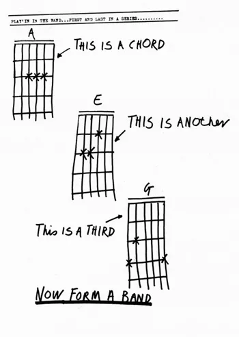

# Scotland, too, is a voluntary union

<blockquote>
Hou can ye say til your brither, ‘Lat me tak yon spail out o your ee’, na here a dail in your ain ee aa the time? Ye hýpocríte, first tak the dail out o your ain ee, an syne ye s’ see richt tae tak the spail out o your brither’s ee!
<footer>Lorimer <cite>Matthew 7-5</cite></footer></blockquote>

Scotland is a voluntary union - of Scot and Gael and northern islanders.

When I was a bairn my grannie would say to me when I was gurning *the wind'll change and you'll be stuck with that face*.

When Ireland became independent the wind changed, and the old ways of the UK were fossilised in parts - Irish local government is always 1922. With a great war and an insurrection and an independence war and a civil war the one on top of the other, that is perhaps understandable. For Scotland it would be inexcusable.

If we are serious as a national movement we need to start planning for the constitution after independence.

To that end I am seek collaborators to work on a Draft Bill of the Scottish Parliament to provide autonomy for the Gàidhealtachd based on the [Åland Islands Autonomy Statue](./resources/FI_SE_930101_Act_on_the_Autonomy_of_Aland.pdf).

This is the old punk strategy:

I've done it, lets us do it, then lets get them to do it.

The goal is to take an existing legal instrument and build out our own version of it as it applies to Scotland and subject to the restrictions of the Scotland Act and publish that as a campaigning and discussion document.

If you are interested - hit me up gordon@hypernumbers.com